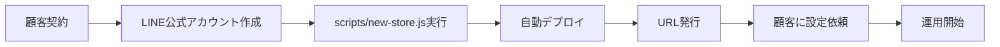

# 🏭 LINE Bot 量産化ガイド

複数店舗向けにLINE Botを量産展開するための完全ガイドです。

## 📋 概要

このシステムは、複数の店舗それぞれに独立したLINE Botを簡単にデプロイできるよう設計されています。

### 特徴
- ✅ **店舗ごとに独立したLINE公式アカウント**
- ✅ **個別のデプロイとURL**
- ✅ **店舗別カスタマイズ可能**
- ✅ **一元管理ツール**
- ✅ **自動化されたセットアップ**

## 🚀 クイックスタート

### 1. 新規店舗の追加（3分で完了）

```bash
# 対話形式で店舗情報を入力
node scripts/new-store.js
```

必要な情報:
- 店舗ID（例: store-001）
- 店舗名
- LINE Channel Access Token
- LINE Channel Secret
- 管理者パスワード
- 営業時間・定休日

### 2. 自動デプロイ

```bash
# 店舗IDを指定してデプロイ
node scripts/deploy-store.js store-001
```

### 3. 店舗一覧の確認

```bash
# 登録済み店舗を一覧表示
node scripts/list-stores.js
```

## 📁 ディレクトリ構造

```
line-booking-system/
├── api/                    # 共通APIコード
├── config/                 # 店舗別設定ファイル
│   ├── template.env       # テンプレート
│   ├── store-001.env      # 店舗001の設定
│   ├── store-002.env      # 店舗002の設定
│   └── ...
├── deployments/           # デプロイ情報
│   ├── store-001.json    # 店舗001のデプロイ情報
│   └── ...
├── scripts/              # 管理スクリプト
│   ├── new-store.js     # 新規店舗追加
│   ├── deploy-store.js  # デプロイ実行
│   └── list-stores.js   # 店舗一覧表示
└── admin-send.html      # メッセージ送信画面
```

## 🔄 ワークフロー

### 新規顧客獲得時の流れ



1. **顧客との契約締結**
2. **LINE Developer Consoleで新規チャンネル作成**（5分）
3. **new-store.jsで設定ファイル生成**（2分）
4. **deploy-store.jsで自動デプロイ**（1分）
5. **発行されたURLを顧客に提供**
6. **顧客側でWebhook URL設定**
7. **運用開始**

## 🛠️ 詳細設定

### 店舗別カスタマイズ項目

`config/store-xxx.env`で設定可能：

```env
# 基本情報
STORE_NAME=〇〇美容室 渋谷店
STORE_ID=store-001

# メッセージカスタマイズ
RESERVATION_MESSAGE=ご予約ありがとうございます！
BUSINESS_HOURS=10:00-20:00
CLOSED_DAYS=毎週水曜日

# 拡張機能
GOOGLE_CALENDAR_ID=xxx
SLACK_WEBHOOK_URL=xxx
```

### 環境変数の優先順位

1. Vercelの環境変数（最優先）
2. 店舗別設定ファイル（config/store-xxx.env）
3. デフォルト値

## 📊 管理・運用

### 複数店舗の一括更新

全店舗のコードを更新する場合：

```bash
# 1. コードを更新
# 2. 各店舗を再デプロイ
for store in store-001 store-002 store-003; do
  node scripts/deploy-store.js $store
done
```

### バックアップ

```bash
# 設定ファイルのバックアップ
cp -r config/ backup/config-$(date +%Y%m%d)/

# デプロイ情報のバックアップ
cp -r deployments/ backup/deployments-$(date +%Y%m%d)/
```

### 店舗の削除

```bash
# 1. Vercelプロジェクトを削除
vercel remove line-bot-store-001

# 2. 設定ファイルを削除
rm config/store-001.env
rm deployments/store-001.json
```

## 💰 料金体系

### LINE Messaging API
- **無料枠**: 月1000通まで
- **ライトプラン**: 月額5,000円で15,000通
- **スタンダードプラン**: 月額15,000円で45,000通

### Vercel
- **無料枠**: 
  - 100GBの帯域幅/月
  - 100時間の実行時間/月
  - 無制限のデプロイ
- **Proプラン**: $20/月でチーム機能と優先サポート

### 推奨構成
- 小規模店舗（月1000通以下）: 無料
- 中規模店舗: LINE ライトプラン + Vercel無料
- 大規模/複数店舗: LINE スタンダード + Vercel Pro

## 🔐 セキュリティ

### 店舗間の分離
- 各店舗は独立したVercelプロジェクト
- 環境変数は店舗ごとに分離
- アクセストークンは店舗固有

### 管理者権限
- 店舗ごとに異なる管理者パスワード
- メッセージ送信は認証必須
- ログで全操作を記録

## 📈 スケーリング戦略

### 10店舗まで
- 手動管理で十分
- scripts/を使用した半自動化

### 10-50店舗
- CI/CDパイプライン構築
- 管理ダッシュボード開発
- データベース導入

### 50店舗以上
- Kubernetes等のコンテナオーケストレーション
- マイクロサービス化
- 専用管理システム

## 🆘 トラブルシューティング

### よくある問題

#### Q: デプロイが失敗する
```bash
# Vercelにログイン
vercel login

# プロジェクトをリセット
vercel remove line-bot-store-xxx
node scripts/deploy-store.js store-xxx
```

#### Q: 環境変数が反映されない
```bash
# 強制再デプロイ
vercel --prod --force
```

#### Q: 店舗IDを変更したい
1. 新しいIDで`new-store.js`実行
2. 設定内容をコピー
3. 新IDでデプロイ
4. 古いプロジェクトを削除

## 📝 チェックリスト

### 新規店舗セットアップ
- [ ] LINE公式アカウント作成
- [ ] Messaging APIチャンネル作成
- [ ] アクセストークン発行
- [ ] `new-store.js`実行
- [ ] `deploy-store.js`実行
- [ ] Webhook URL設定
- [ ] 応答モード「Bot」設定
- [ ] 友だち追加
- [ ] テストメッセージ送信
- [ ] 顧客への引き渡し

### 月次メンテナンス
- [ ] 各店舗の稼働確認
- [ ] メッセージ送信数確認
- [ ] エラーログ確認
- [ ] セキュリティアップデート
- [ ] バックアップ実行

## 🎯 ベストプラクティス

1. **命名規則を統一**
   - 店舗ID: `store-001`, `store-002`
   - 顧客名を含める: `tanaka-dental-001`

2. **ドキュメント管理**
   - 各店舗の設定内容を記録
   - 顧客連絡先を管理
   - 変更履歴を記録

3. **テスト環境**
   - `store-test`を常に用意
   - 新機能は必ずテスト環境で確認

4. **監視**
   - Vercelのダッシュボードで監視
   - エラー通知設定
   - 定期的な死活監視

## 🚀 今すぐ始める

```bash
# 1. テスト店舗を作成
node scripts/new-store.js
# store-testと入力

# 2. デプロイ
node scripts/deploy-store.js store-test

# 3. 動作確認後、本番店舗を追加
node scripts/new-store.js
# store-001と入力
```

---

**サポート**: 問題が発生した場合は、`TROUBLESHOOTING.md`を参照してください。